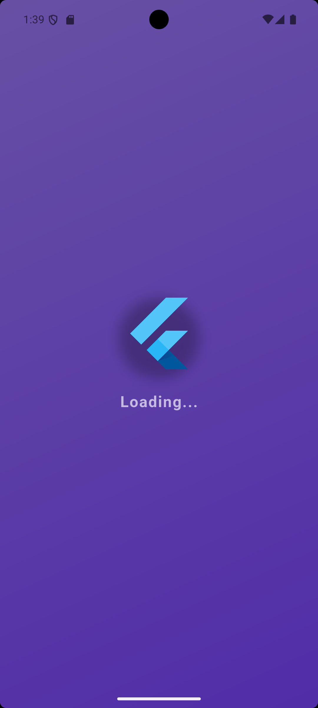
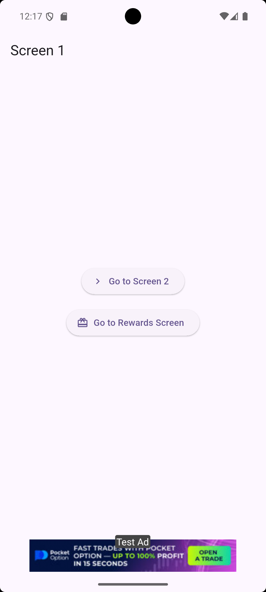
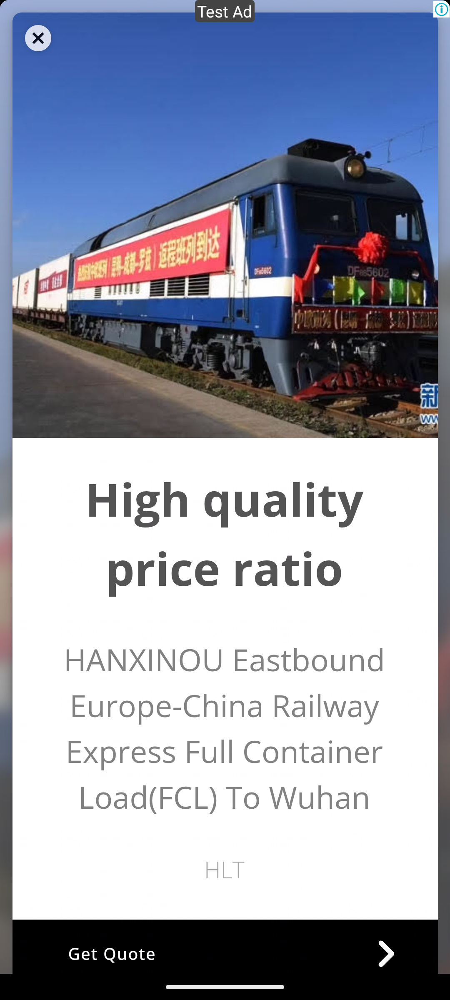
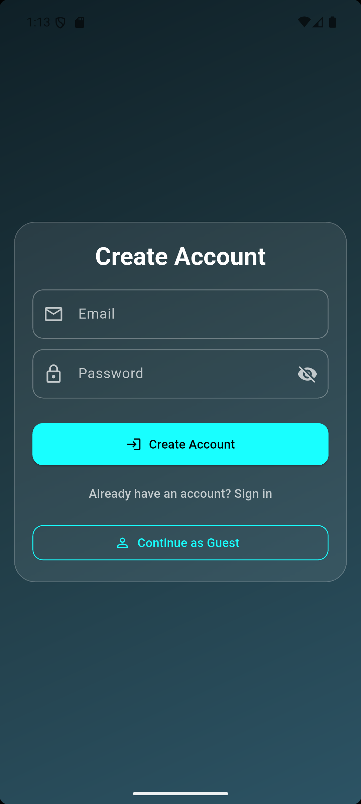
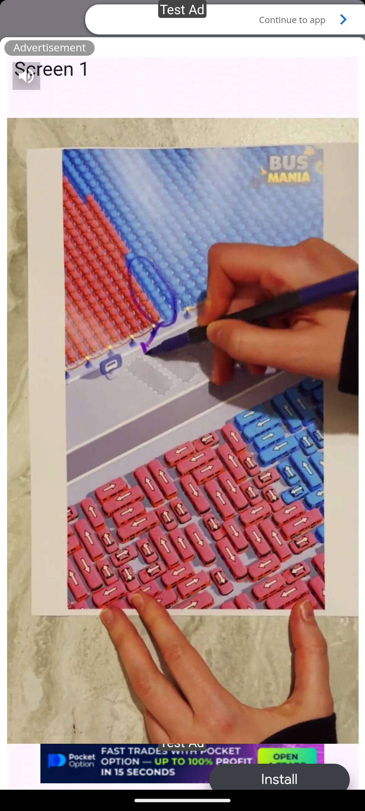

# 📱 Ad Mint

A production-ready Flutter app for **ad integration and management**, supporting **Banner, Interstitial, Rewarded, App Open, and Native Ads** with Google AdMob. Fully modular and optimized for performance.

---

## ✨ Features

- 📊 Support for multiple **Ad types**:
  - Banner Ads
  - Interstitial Ads
  - Rewarded Ads
  - App Open Ads
  - Native Ads
- 🔁 **Preloading and caching** ads for smooth display
- 🛡 **Safe ad display** with error handling
- 🎛 **Control and customization** of ad units via provider
- ⏱ Splash screen with App Open Ad support
- 💻 Modular **AdService** architecture for production-level apps
- 🧩 Easy integration in **Flutter screens**
- 📦 Optimized for **performance and memory management**

---

## 🛠 App Structure

- **services/** → Handles ad loading, preloading, and display logic.
- **widgets/** → Banner, native, and reusable ad widgets.
- **provider/** → Manages state for ad preloads and global ad service.
- **screens/** → Splash, main screens, and example navigation with ads.

---

## 📸 Screenshots

| Splash Screen | Banner Ad | Interstitial Preview |
|---------------|-----------|--------------------|
|  |  |  |

| Rewarded Ad | Login | App Open Ad |
|------------|-----------|-------------|
|  |  |  |

> ℹ️ To add your screenshots:
> - Save them in `assets/screenshots/`
> - Add entries in `pubspec.yaml` under `assets:`

---

## 🚀 Getting Started

**### 1. Clone the Repo**

git clone https://github.com/your-username/ad_mint.git
cd ad_mint

**###2. Install Dependencies**

flutter pub get

**###3. Firebase & AdMob Setup**

Create a Firebase project.

Enable AdMob and generate ad unit IDs for Android/iOS.

Enable Email/Password Authentication if using auth.

Download google-services.json (Android) and/or GoogleService-Info.plist (iOS).

Place them in the respective platform folders:

Android: android/app/

iOS: ios/Runner/

**###4. Run the App**

flutter run
