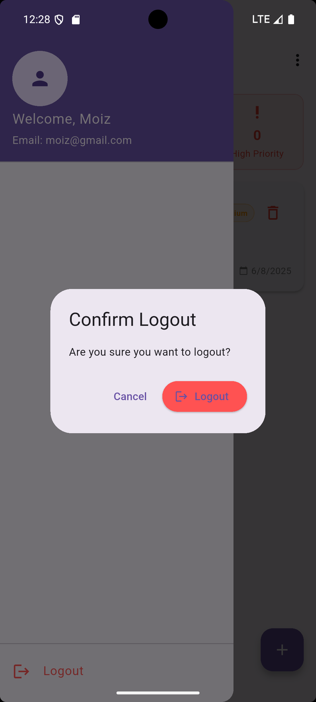

# 🌌 TaskOrbit

[](https://flutter.dev)
[](https://flutter.dev)
[](LICENSE)
[](https://github.com/moizsahto)

A beautiful and highly interactive Flutter task manager app with real-time filtering, priority-based task separation, Firebase Authentication, and stunning animations like shimmer and glassmorphism.

---

## ✨ Features

- 🧠 Filter tasks by **category** or **priority**
- ✅ Toggle **completion status** with visual feedback
- 🔐 Firebase Authentication – Login/Signup with user profiles
- 👤 Welcome message with user's name after login
- 💾 Persistent login state using SharedPreferences
- 📅 Last login time stored in Realtime Database
- 🎨 Shimmer loading effects
- 💎 Glassmorphic UI panels
- 🗂 SQLite local storage for offline access
- 🔁 State managed with **Provider**
- 🚀 Smooth splash screen & transitions with animations

---

## 🔐 User Authentication (Firebase)

### Objective

Implement a **Login & Registration** system using Firebase Authentication and Firebase Realtime Database, integrated seamlessly into TaskOrbit.

### 🔧 Implemented Features

1. **Register New User**
   - Email and password registration using Firebase Authentication.
   - Store user profile (name, email, last login time) in Firebase Realtime Database.

2. **Login Existing User**
   - Login with Firebase Authentication.
   - Retrieve user profile from Realtime Database.
   - Show welcome message with user's name.

3. **Form Validation and Feedback**
   - Checks for empty fields and invalid inputs.
   - Displays loading indicators and real-time error messages.

4. **App Integration**
   - Auth screen is the app’s entry point.
   - After login, users are navigated to the Task List screen.

5. **Architecture**
   - MVVM pattern used (AuthViewModel, UserProvider).
   - Auth logic separated from UI.
   - Persistent session with SharedPreferences.

---

## 📸 Screenshots

| Splash Screen | Task List | Add/Edit Task |
|---------------|------------|----------------|
|  |  |  |

| Auth Screen | Alert Box  | Welcome message|
|-------------|------------|----------------|
|  |  |  |

> ℹ️ To add your screenshots:
> - Save them in `assets/screenshots/`
> - Add entries in `pubspec.yaml` under `assets:`

---

## 🚀 Getting Started

### 1. Clone the Repo
```bash```
git clone https://github.com/your-username/taskorbit.git
cd taskorbit

### 2. Install Dependencies
bash
Copy
Edit
flutter pub get

### 3. Firebase Setup
Create a Firebase project.

Enable Email/Password Authentication in Firebase Console.

Enable Realtime Database (in test mode for development).

Download google-services.json and place it in android/app/.

### 4. Run the App

flutter run

